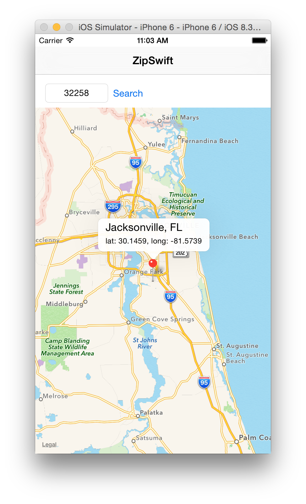

# ZipSwift
ZipSwift is an iOS application, written in Swift, that displays US ZIP code information on a map. It uses [Zippopotam.us](http://www.zippopotam.us/) for ZIP code information.

## Build
Clone the repo, open in Xcode, and build.

## Usage
Enter a 5-digit ZIP code in the entry field in the upper left and tap Search. If the ZIP code you enter is valid, you will see the map zoom into the corresponding location, with an annotation naming the city, state, latitude, and longitude corresponding to that ZIP code, as seen below.

## Purpose
ZipSwift was written to demonstrate how to develop iOS applications in Swift. It also demonstrates:

* Using Cocoapods
* Calling Objective-C code from Swift
* Using RestKit to call REST services
* Using Core Data, integrated with RestKit
* Displaying locations using MapKit
* Writing unit tests using XCTest

## Contributing
Fork the repo and send pull requests!
